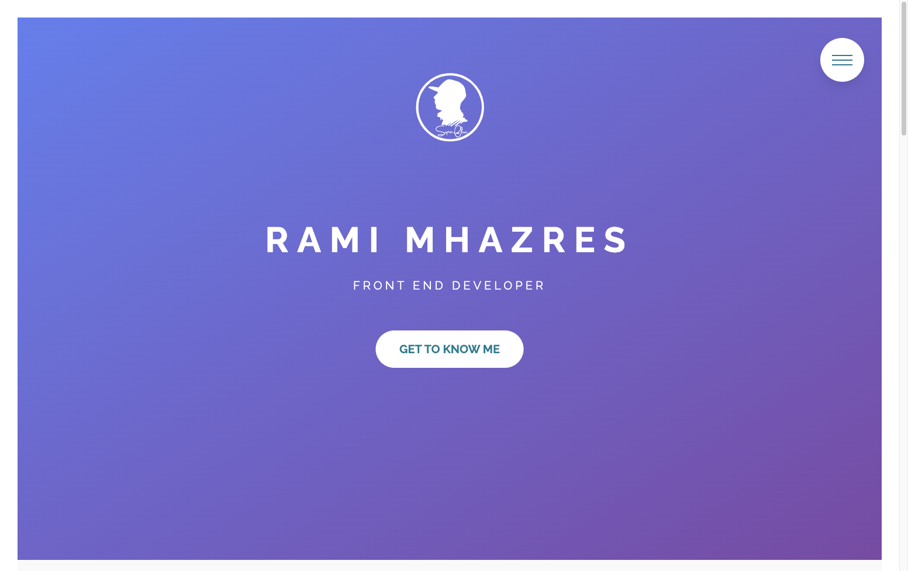
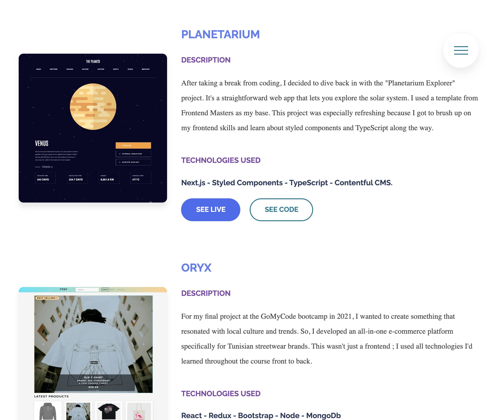

# Rami Mhazres - Front End Developer Portfolio

Welcome to the repository for my personal portfolio. Here, I've showcased my journey, skills, and some of the projects I've worked on as a Front End Developer.

## Overview

- **Personal Introduction**: Learn more about my background, my journey into coding, and my personal interests.
- **Projects**: A showcase of my work, detailing the technologies used.
- **Contact**: Reach out to me directly from the site or through my social media handles.

## Technologies Used

- **Frontend**: <HTML , SASS>
- **Hosting**: <GITHUB Pages>

## Features

1. **Responsive Design**: The portfolio is optimized for mobile and desktop viewing.
2. **Dynamic Projects Section**: Displays my recent projects with options to view the live site and the source code.
3. **Contact Form**: Allows users to reach out directly through the site.

## Running Locally

If you'd like to run my portfolio locally:

4. **Clone this repository**:
   cd path-to-directory
   npm install
   npm run compile:sass

5. **Feedback and Contributions**:I always welcome feedback and improvements. Please feel free to fork the repository and create pull requests or create an issue if you find any bugs or have feature requests.
